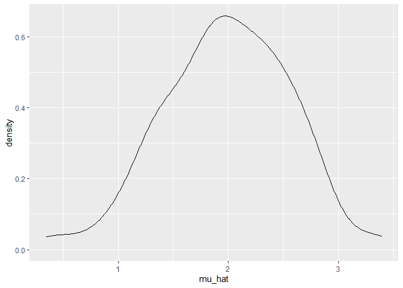
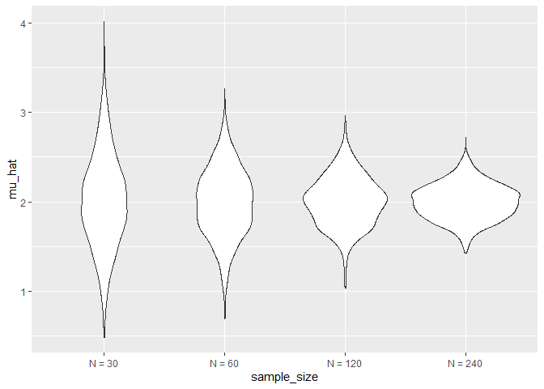
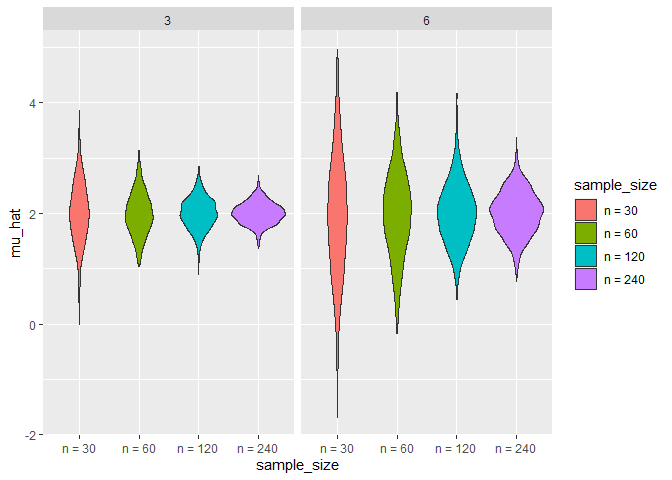

Simulation
================

    ## ── Attaching packages ─────────────────────────────────────── tidyverse 1.3.2 ──
    ## ✔ ggplot2 3.3.6      ✔ purrr   0.3.4 
    ## ✔ tibble  3.1.8      ✔ dplyr   1.0.10
    ## ✔ tidyr   1.2.0      ✔ stringr 1.4.1 
    ## ✔ readr   2.1.2      ✔ forcats 0.5.2 
    ## ── Conflicts ────────────────────────────────────────── tidyverse_conflicts() ──
    ## ✖ dplyr::filter() masks stats::filter()
    ## ✖ dplyr::lag()    masks stats::lag()

``` r
sim_mean_sd = function(n, mu = 2, sigma = 3) {
  
  sim_data = tibble(
    x = rnorm(n, mean = mu, sd = sigma),
  )
  
  sim_data %>% 
    summarize(
      mu_hat = mean(x),
      sigma_hat = sd(x)
    )
}
```

``` r
output = vector("list", 100)

for (i in 1:100) {
  output[[i]] = sim_mean_sd(30)
}

sim_results = bind_rows(output)
```

FYI you could have said: .x = sample_size, \~sim_mean_sd(n_obs = .x)

The tilde means that I’m telling you to put it INTO here

purr package = .x and .y are CUMPOLSORY you should not have anywhere
else called .x or .y

``` r
sim_results_df = 
  expand_grid(
    sample_size = 30,
    iter = 1:100
  ) %>% 
  mutate(
    estimate_df = map(sample_size, sim_mean_sd)
  ) %>% 
  unnest(estimate_df)
```

*What does map allow us to do:* - take the first element and apply that
function and do it all subsequently

*What does unnest do* - simple limit theorem - look up - to drive all
tibbles –\> separate - what you have is a list column ( 2 col with x and
y respectively) - by unnest –\> you can analyze the dataframe

*Why use expand grid* expand_grid: - I want an input column that is the
SAME everywhere - keeps track of where you are and which variable to use

*sim_results_df*

-   when I gnenerate a 100 datasets, with a true mean of X and a sample
    mean will vary over time

``` r
sim_results_df %>% 
  ggplot(aes(x = mu_hat)) + 
  geom_density()
```

<!-- -->

*CLT*

-   Can you model what happens when your sample size gets bigger? - when
    you map across that sample size column you gor row by row and
    compute the mean

``` r
sim_results_df = 
  expand_grid(
    sample_size = c(30, 60, 120, 240),
    iter = 1:1000
  ) %>% 
  mutate(
    estimate_df = map(sample_size, sim_mean_sd)
  ) %>% 
  unnest(estimate_df)
```

*We can now see what is the distribution*

FYI violin plot assumes not a number = x fct inorder = sample size as it
appears in my df

``` r
sim_results_df %>% 
  mutate(
    sample_size = str_c("N = ", sample_size),
    sample_size = fct_inorder(sample_size)
  ) %>% 
  ggplot(aes(x = sample_size, y = mu_hat)) + 
  geom_violin()
```

<!-- -->

``` r
sim_results_df = 
  expand_grid(
    sample_size = c(30, 60, 120, 240),
    true_sd = c(6, 3),
    iter = 1:1000
  ) %>% 
  mutate(
    estimate_df = 
      map2(.x = sample_size, .y = true_sd, ~sim_mean_sd(n = .x, sigma = .y))
  ) %>% 
  unnest(estimate_df)
```

Above you see that the syntax is map2 = function ONLY for two arguments;
notice that you have to do it explicitly

*power of simulations is that you can model and test theories etc*

``` r
sim_results_df %>% 
  mutate(
    sample_size = str_c("n = ", sample_size),
    sample_size = fct_inorder(sample_size)) %>% 
  ggplot(aes(x = sample_size, y = mu_hat, fill = sample_size)) + 
  geom_violin() + 
  facet_grid(. ~ true_sd)
```

<!-- --> An
additional rmd code chunk - very specific to a specific code - if truly
new –\> will rerun - otherwise will save - r will not keep track of
overwriting existing variables if they are different
